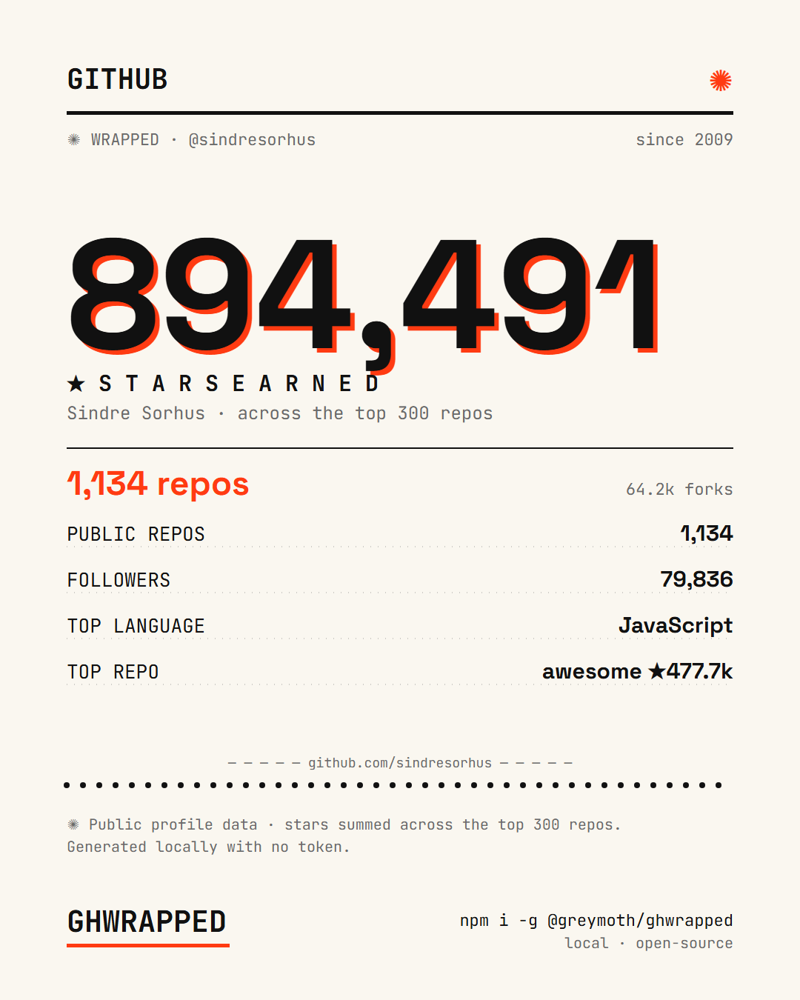

# ghwrapped ✺

**Your GitHub profile, printed.** A tiny CLI that turns any public GitHub profile into a beautiful,
shareable **risograph Wrapped card** — stars, repos, followers, top language & repo.

Public data only. No token. No servers.

<p align="center"></p>

```bash
npm i -g @greymoth/ghwrapped
ghwrapped sindresorhus              # print stats in the terminal
ghwrapped sindresorhus --wrapped    # → github-wrapped-sindresorhus.svg (open in a browser, screenshot)
```

```
  ✺ GITHUB   @sindresorhus
  ★ 894,491 stars  ·  1,134 repos  ·  79,836 followers
  since 2009 · stars across top 300 repos
  top language: JavaScript
  top repo: awesome ★477,720
```

## The card
`ghwrapped <user> --wrapped [out.svg]` writes a self-contained SVG (fonts embedded) — open it in any
browser and screenshot to share. Same risograph editorial identity as
[ccwrapped](https://github.com/greymoth-jp/ccwrapped).

## Notes
- Uses the **unauthenticated** GitHub API (60 requests/hour). One profile costs 2–4 requests.
- Stars are summed across up to 300 of the user's most-recently-pushed repos (covers the vast
  majority of accounts); the card says so when a profile has more.
- Public data only — no token, nothing stored.

## License
MIT. Bundled fonts: Space Grotesk & JetBrains Mono (SIL Open Font License).
